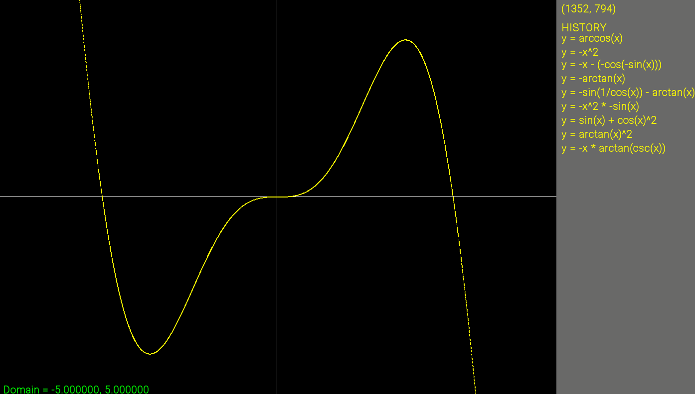

# Graphing Calculator



This is a simple graphing calculator application built with C++ and SFML. It allows you to input mathematical functions and visualize them.

## Features

- Plot mathematical functions with 'x' as the variable.
- Zoom in and out of the graph.
- Pan left and right.
- Equation history sidebar.
- Help screen with keybinds.

## Requirements

To build and run this project, you will need:

- A C++17 compliant compiler (like g++ or Clang)
- CMake (version 3.20 or higher)
- Git

The project uses SFML 3.0.1 and GoogleTest, but these are downloaded automatically by CMake during the build process.

## How to Build and Run

1.  **Clone the repository:**
    ```bash
    git clone https://github.com/gchen0002/GraphingCalc.git
    cd GraphingCalc
    ```

2.  **Create a build directory:**
    ```bash
    mkdir build
    cd build
    ```

3.  **Configure the project with CMake:**
    ```bash
    cmake ..
    ```

4.  **Build the project:**
    - On Windows (with Visual Studio):
      ```bash
      cmake --build .
      ```
    - On macOS/Linux:
      ```bash
      make
      ```

5.  **Run the application:**
    The executable will be in the `build/bin` directory.
    ```bash
    ./bin/main
    ```

## Keybinds

-   **`F1`**: Toggle the help screen.
-   **`Backspace`**: Open a text box to enter a new equation.
-   **`Enter`**: Submit the equation in the text box.
-   **`-`** (Hyphen): Zoom out.
-   **`=`** (Equals) or **`+`** (Plus): Zoom in.
-   **`Left Arrow`**: Pan the view to the left.
-   **`Right Arrow`**: Pan the view to the right.
-   **`Mouse Left Click`** on an equation in the history sidebar to load it.
-   **`ESC`**: Close the application.

